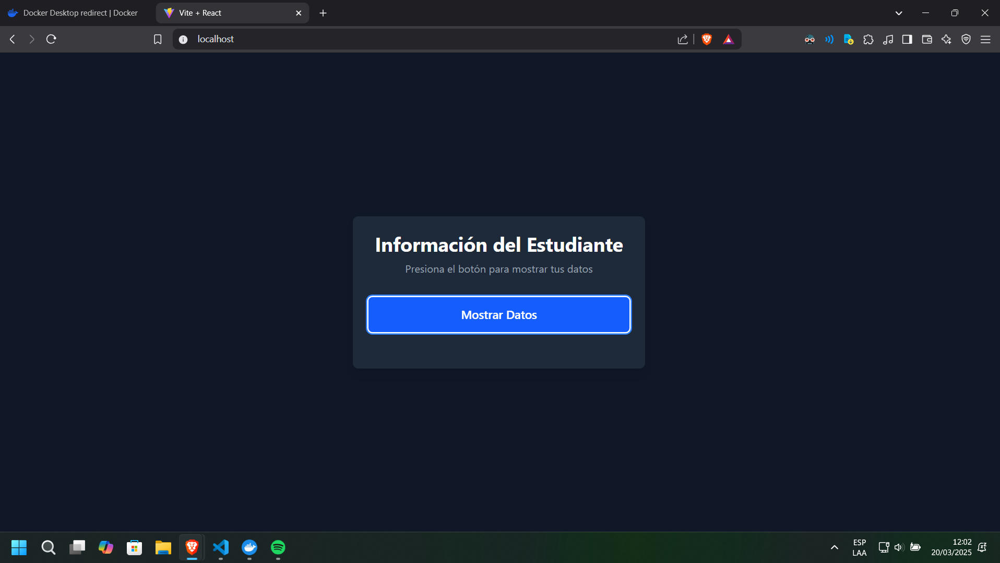
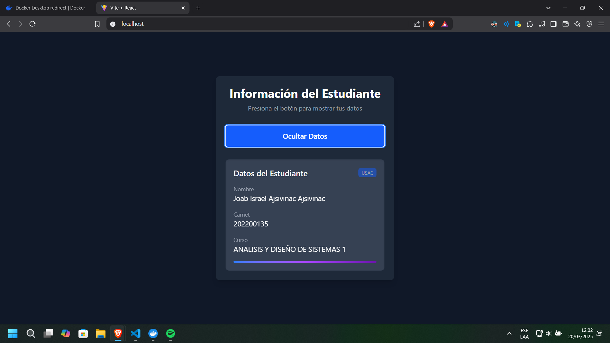

## Tarea 2

Este proyecto se puede ejecutar en un contenedor Docker en el puerto **80**.

### 📌 Requisitos previos
Antes de comenzar, asegúrate de tener instalado:

- [Docker](https://www.docker.com/get-started) en tu sistema.
- Acceso a línea de comandos para ejecutar los comandos de Docker.

#### ⚙ Tecnologías Utilizadas 

<div align="center" style="display:flex;justify-content:center;gap:20px">
 <a href="https://skillicons.dev">
    
  </a>
</div>
<ul>
  <li>React</li>
  <li>Tailwindcss</li>
  <li>Docker</li>
  <li>Nginx</li>
</ul>

### 🚀 Construcción y ejecución del contenedor

1. **Construir la imagen Docker:**
   ```sh
   docker build -t <nombre_de_imagen> <directorio_de_contexto>
   ```
   - **`-t <nombre_de_imagen>`**: Asigna un nombre a la imagen Docker que se va a construir. Reemplaza `<nombre_de_imagen>` por el nombre que desees, como `jajsivianc/ayd1-tarea2`.
   - **`<directorio_de_contexto>`**: Especifica el directorio que se usará como contexto para la construcción de la imagen. El punto `.` indica que el contexto es el directorio actual.

   Ejemplo:
   ```sh
   docker build -t jajsivianc/ayd1-tarea2 .
   ```

2. **Verificar que la imagen se haya creado correctamente:**
   ```sh
   docker images
   ```
   Este comando lista todas las imágenes disponibles en tu sistema. Deberías ver `jajsivianc/ayd1-tarea2` en la lista si la construcción fue exitosa.

3. **Ejecutar el contenedor en el puerto 80:**
   ```sh
   docker run -d -p <puerto_local>:<puerto_contenedor> --name <nombre_contenedor> <nombre_imagen>
   ```
   - **`-d`**: Ejecuta el contenedor en segundo plano (detached mode).
   - **`-p <puerto_local>:<puerto_contenedor>`**: Mapea un puerto de tu máquina local al puerto del contenedor. En este caso, estamos mapeando el puerto **80** del contenedor al puerto **80** de la máquina local.
   - **`--name <nombre_contenedor>`**: Asigna un nombre al contenedor. Puedes reemplazar `<nombre_contenedor>` con el nombre que prefieras, como `tarea2-container`.
   - **`<nombre_imagen>`**: Especifica el nombre de la imagen a utilizar para crear el contenedor. En este caso, `jajsivianc/ayd1-tarea2`.

   Ejemplo:
   ```sh
   docker run -d -p 80:80 --name tarea2-container jajsivianc/ayd1-tarea2
   ```

4. **Verificar que el contenedor está corriendo:**
   ```sh
   docker ps
   ```
   Este comando muestra los contenedores activos. Deberías ver `tarea2-container` en la lista si está corriendo correctamente.

5. **Acceder a la aplicación:**
   Abre un navegador y dirígete a `http://localhost`.


### 🏗️ Detalles del Dockerfile
El `Dockerfile` incluido en este repositorio se usa para crear la imagen de la aplicación. Asegúrate de revisarlo y modificarlo según sea necesario.

### 📷 Imagenes




